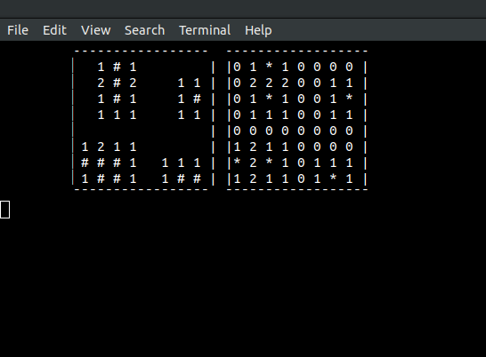

# Campo Minado



Modo de debug

## Como usar

Entre no diretório baixado com

```sh
cd minesweeeper-c
```

Compile:
```sh
gcc src/main.c
```

Execute:
```sh
./a.out
```

## Como jogar
Digite `<y> <x>`, sendo que `y` e `x` vão de 0 a 7 de cima para baixo e da esquerda para a direita respectivamente.

Exemplo:

```sh
7 0
```
